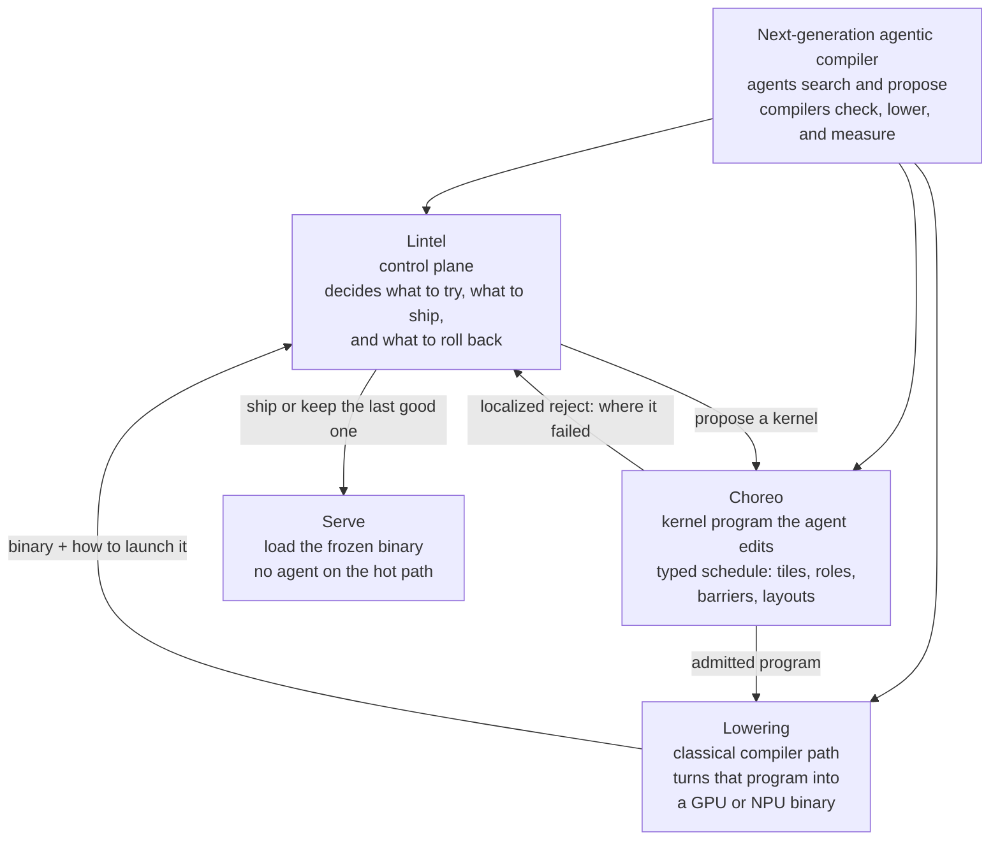

# Goal: next-generation agentic compiler

Status: **final**. Durable. Do not drop, bury, or replace this picture.

Skill: [`skills/choreo-lintel-codesign/SKILL.md`](../skills/choreo-lintel-codesign/SKILL.md).
Implementer detail (do not let it overwrite this): [`lintel-codesign.md`](lintel-codesign.md).

## Never forget

The goal is a **next-generation agentic compiler**: agents search and propose; compilers check, lower, and measure. Serving never re-runs the agent.

Three cooperating pieces:

| Piece | Role |
|---|---|
| **Lintel** | Control plane. Decides what to try, what to ship, and what to roll back. |
| **Choreo** | The kernel program the agent edits. Typed schedule: tiles, roles, barriers, layouts. |
| **Lowering** | Classical compiler path. Turns that program into a GPU or NPU binary. Not an LLM. |

Do not mix these. Lintel does not grow kernel keywords. Choreo does not freeze, ship, or score serving. Lowering does not search.

## Architecture



```text
  next-generation agentic compiler     ← the goal

  searcher
     │
     ▼
  Lintel          walk a specialize job
     │               propose a kernel
     ▼
  Choreo          the program  +  checks before codegen
     │               pass → lower     fail → try the next kernel
     ▼
  Lowering        GPU cubin  or  NPU binary
     │
     ▼
  Lintel          measure on the real serving path
                  keep it, or revert
     │
     ▼
  Serve           frozen binary only. no model in the loop.
```

## Laws

1. This picture is the product cut. Detail docs explain it; they do not replace it.
2. Agents own search and proposal. Compilers own legality, codegen, and measure.
3. Serve loads a frozen binary. No model in the loop.
4. Lowering is classical and must consume the schedule Choreo named.
5. Localized reject (where it failed) is the only feedback Choreo owes the searcher.
