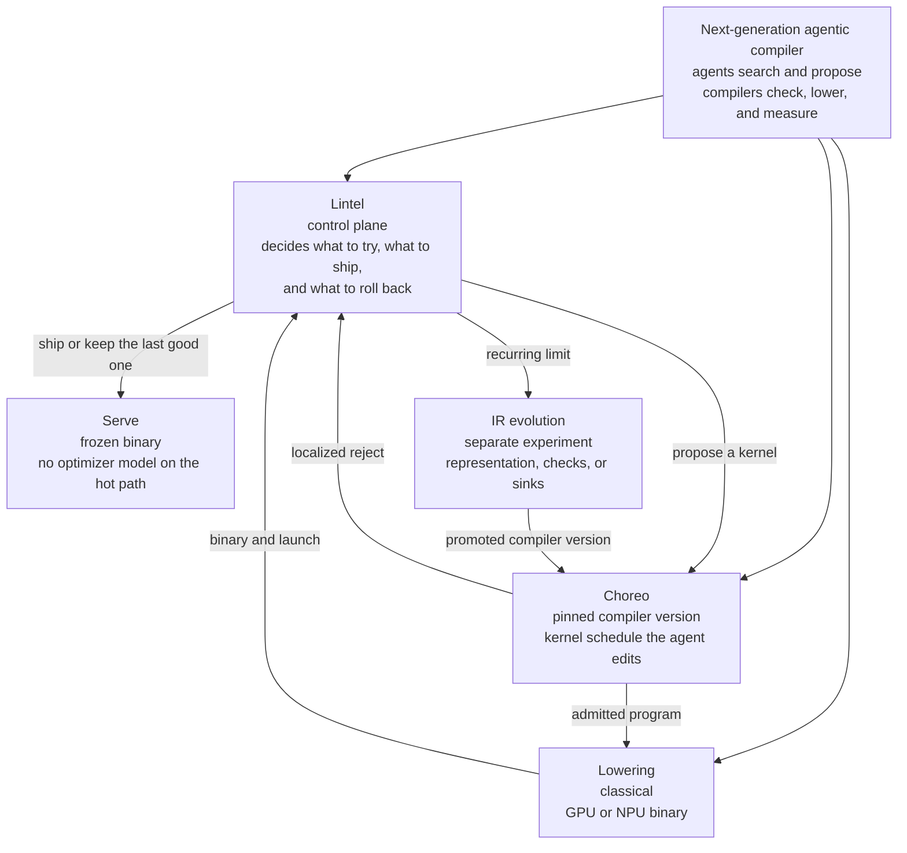

# Goal: next-generation agentic compiler

Status: **starting architecture**, revised **2026-09-29** against [zackc6/ai-compiler-survey](https://github.com/zackc6/ai-compiler-survey) through **2026-09-23**. Durable for this tree. It is a design to test, not a proof that every compiler must keep this split.

Skill: [`skills/choreo-lintel-codesign/SKILL.md`](../skills/choreo-lintel-codesign/SKILL.md).
Implementer detail (do not let it overwrite this): [`lintel-codesign.md`](lintel-codesign.md).

## Never forget

Agents search and propose. This compiler checks, lowers, and returns a localized reject. Serving loads an accepted binary and does not call an optimizer model on the hot path.

Three pieces:

| Piece | Role |
|---|---|
| **Lintel** | Control plane (other repo). Decides what to try, what to ship, and what to roll back for the current application. |
| **Choreo** | Kernel-schedule compiler in this repo. The program the agent edits, the checks, and the classical lowering. |
| **Serve** | Load the frozen binary. |

Keep the three loops below apart. An application search that invents an opcode, or a control-plane edit recorded as a new IR, has mixed them.

## Three loops

```text
Application search
  compiler version pinned
  propose a kernel → check → reject (where) → next kernel
                  → pass → lower → binary
  Lintel measures the application and keeps or reverts

IR evolution          ← the self-evolving loop in this compiler
  a separate experiment
  a recurring reject, or a schedule the sink cannot express
  → change the representation, a check, or a sink
  → re-check kernels that did not motivate the change
  → promote a new compiler version on main
  the next application search pins that version

Controller improvement
  not this repo
  changes how the search decides (instructions, strategy, orchestration)
  late, gated, and unproven at application level as of 2026-09-23
```


```mermaid
flowchart TB
  GOAL["Next-generation agentic compiler<br/>agents search and propose<br/>compilers check, lower, and measure"]

  LINTEL["Lintel<br/>control plane<br/>decides what to try, what to ship,<br/>and what to roll back"]
  CHOREO["Choreo<br/>pinned compiler version<br/>kernel schedule the agent edits"]
  LOWER["Lowering<br/>classical<br/>GPU or NPU binary"]
  SERVE["Serve<br/>frozen binary<br/>no optimizer model on the hot path"]
  EVOLVE["IR evolution<br/>separate experiment<br/>representation, checks, or sinks"]

  GOAL --> LINTEL
  GOAL --> CHOREO
  GOAL --> LOWER

  LINTEL -->|"propose a kernel"| CHOREO
  CHOREO -->|"localized reject"| LINTEL
  CHOREO -->|"admitted program"| LOWER
  LOWER -->|"binary and launch"| LINTEL
  LINTEL -->|"ship or keep the last good one"| SERVE
  LINTEL -->|"recurring limit"| EVOLVE
  EVOLVE -->|"promoted compiler version"| CHOREO
```

## Scope

Start at the kernel schedule: tiles, roles, barriers, layouts, memory spaces. Lower that schedule to NVIDIA GPU and Ascend NPU. Kernel interfaces are where the public evidence is strongest. A fixed stack of bands is not a law, and one kernel language is not established.

Widen that scope when a measured bottleneck sits outside the kernel (communication, memory movement, launch overhead, runtime scheduling). The widening is a promoted Choreo version whose new construct has a check and a sink, or a separate representation that Lintel coordinates. Framework graphs, MLIR pipelines, and placement stay out of `Kernel`.

NVIDIA and Ascend stay separate sink families behind one finding schema.

## Laws

1. This picture is the product cut for this repository. Detail docs explain it.
2. Application search edits programs. IR evolution edits this compiler. Controller improvement edits the decision procedure.
3. Inside one application search the compiler version is pinned.
4. A representation change ships as a promoted version: a check that admits it, sinks that lower it on both families, and a regression look at kernels that did not ask for it.
5. Acceptance rules stay fixed during a search. The optimizer does not rewrite `check` so the current kernel passes.
6. Serve loads a frozen binary. No optimizer-model call on the default execution path.
7. Lowering is classical and consumes the schedule Choreo named.
8. A localized reject is the only feedback Choreo owes the application searcher.

Revisit this cut when the survey’s 23 September 2027 scope and controller checkpoints are recorded, or when this tree promotes a compiler version on a held-out kernel set.
