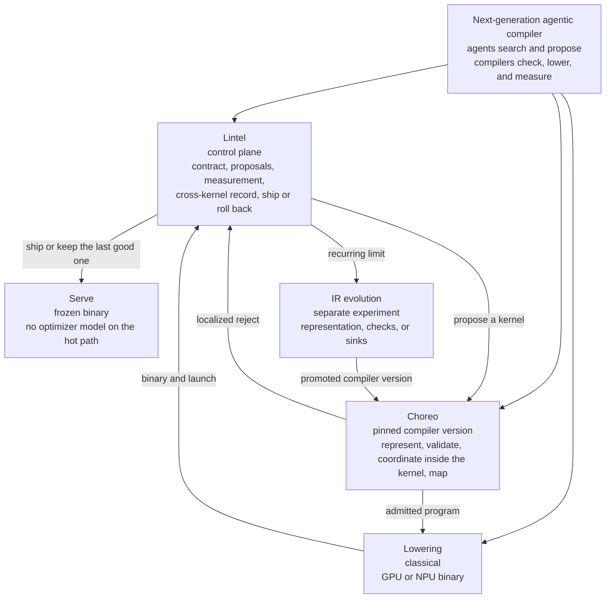

# Goal: next-generation agentic compiler

Status: **early architecture**, revised **2026-09-29** against [zackc6/ai-compiler-survey](https://github.com/zackc6/ai-compiler-survey) through **2026-09-23** (necessary functions in §3.1, replaceable starting architecture in §3.3, decision areas in §5.1.2). Durable for this tree. It is a design to test, not a proof that every compiler must keep this split.

Skill: [`skills/choreo-lintel-codesign/SKILL.md`](../skills/choreo-lintel-codesign/SKILL.md).
Implementer detail (do not let it overwrite this): [`lintel-codesign.md`](lintel-codesign.md).

## Never forget

Agents search and propose. This compiler checks, lowers, and returns a localized reject. Serving loads an accepted binary and does not call an optimizer model on the hot path.

Three pieces:

| Piece | Role |
|---|---|
| **Lintel** | Control plane (other repo). Decides what to try, what to ship, and what to roll back for the current application. Holds the contract, the cross-kernel record, and the application score. |
| **Choreo** | Compiler in this repo. The kernel schedule the agent edits, the checks, and the classical lowering. |
| **Serve** | Load the frozen binary. |

Keep the three loops below apart. An application search that invents an opcode, or a control-plane edit recorded as a new IR, has mixed them.

## Early architecture

Humans fix the contract: the semantics, the numerical acceptance, and the objective. The running system is replaceable parts with explicit interfaces. Survey forecast dates are evidence reviews for that document. They do not set this design’s scope.

| Part | Owner | Early interface |
|---|---|---|
| Contract | Recorded by Lintel | What an accepted implementation must satisfy. |
| Candidate generation | Lintel coordinates | An agent, a learned policy, or structured search may propose. Every proposal is a Choreo program under the same checks. |
| Compilation and analysis | Choreo | `check`, then classical `lower`. |
| Evaluation | Lintel measures | Application result under the contract. Choreo’s value gate is the tiny-tile oracle, not this measurement. |
| Artifact store | Lintel | `%k`. This tree emits the `pin.json` payload. |
| Deployment | Serve | Frozen binary. No optimizer-model call on the default path. |

## Function coverage

Five functions are in this architecture from the start. Each has an owner and an interface. A function is covered when a candidate can be accepted or rejected through that interface. A calendar slice does not add or remove a function. One application’s profile does not create the owner.

| Function | What the early design achieves | Owner and interface |
|---|---|---|
| **Represent computation** | A typed kernel schedule preserves the computation, the schedule, the memory placement, and the ordering an agent can edit: ops, dtypes, shapes, layouts (`shape × stride`), spaces, partitions, barriers, pipelines, and target. | Choreo `Kernel`. JSON is a second encoding of that AST. |
| **Transform and optimize** | A search proposes a new `Kernel` under a pinned compiler version. A reusable change to a representation, a check, or a sink is a separate compiler version. | Lintel proposes the program. Choreo admits it. IR evolution is the commit that changes this compiler. |
| **Map to hardware** | An admitted kernel lowers to runnable NVIDIA GPU and Ascend NPU code. Sinks consume partitions, barriers, pipeline depth, layouts, spaces, and global-memory writeback. | Choreo `lower`. Two sink families, one finding schema. |
| **Validate** | Compiler gates name a program point: wellformed, layout, sync, and tiny-tile value. The application contract (numerical tolerance, quality, rollout) is a separate evaluation. | Choreo `W\|L\|S\|V`. Lintel holds the contract and the score. |
| **Coordinate execution** | Inside a kernel, partitions, barriers, and pipelines state who runs and who waits. The artifact records launch geometry so serve can run the binary. Across kernels, a program record names dependencies and placement. | Choreo checks intra-kernel order and writes `launch`. Lintel holds the program record and its `graph_hash`. |

The survey’s decision areas sit on these same interfaces. They are responsibilities, not a stack of bands and not a second list of functions.

| Decision area | Interface |
|---|---|
| Workload and graph | Lintel’s program record: nodes are kernel artifact ids (`cache_key_digest`), edges are producer buffer to consumer buffer, and each node carries `hw_id`. `graph_hash` is the digest of that record. `Kernel` does not re-encode it. |
| Representation and transformation | The `Kernel` AST. Search proposes a replacement kernel. IR evolution changes the representation. |
| Kernel and machine code | `lower` to both families. Device ISA stays inside the sink. Agents do not mutate PTX, SASS, or Davinci. |
| Runtime and distribution | `launch` on the artifact (grid and block from partitions). Placement is the per-node `hw_id` on Lintel’s program record. Communication is an edge whose buffers cross devices. |
| Evaluation and deployment | Findings, then Lintel’s measurement, then the frozen binary. |

A construct covers a function when it has an effect on that function’s interface: a field `check` can reject, a finding that names a program point, a sink that consumes the field, or a control-plane record Lintel can accept or reject. A name with no effect does not cover a function.

`copy` and `gemm_tile` are the regression kernels a representation change must still pass. They are the held-out check for IR evolution. They are not the function set.

## Three loops

```text
Application search
  compiler version pinned
  propose a kernel → check → reject (where) → next kernel
                  → pass → lower → binary
  Lintel measures the application and keeps or reverts

IR evolution          ← the self-evolving loop in this compiler
  a separate experiment
  a recurring reject, or a schedule the sink cannot express
  → change the representation, a check, or a sink
  → re-check kernels that did not motivate the change
  → promote a new compiler version on main
  the next application search pins that version

Controller improvement
  not this repo
  changes how the search decides (instructions, strategy, orchestration)
  a separate experiment; the compiler and the acceptance rules stay fixed
```


```mermaid
flowchart TB
  GOAL["Next-generation agentic compiler<br/>agents search and propose<br/>compilers check, lower, and measure"]

  LINTEL["Lintel<br/>control plane<br/>contract, proposals, measurement,<br/>cross-kernel record, ship or roll back"]
  CHOREO["Choreo<br/>pinned compiler version<br/>represent, validate, coordinate inside the kernel, map"]
  LOWER["Lowering<br/>classical<br/>GPU or NPU binary"]
  SERVE["Serve<br/>frozen binary<br/>no optimizer model on the hot path"]
  EVOLVE["IR evolution<br/>separate experiment<br/>representation, checks, or sinks"]

  GOAL --> LINTEL
  GOAL --> CHOREO
  GOAL --> LOWER

  LINTEL -->|"propose a kernel"| CHOREO
  CHOREO -->|"localized reject"| LINTEL
  CHOREO -->|"admitted program"| LOWER
  LOWER -->|"binary and launch"| LINTEL
  LINTEL -->|"ship or keep the last good one"| SERVE
  LINTEL -->|"recurring limit"| EVOLVE
  EVOLVE -->|"promoted compiler version"| CHOREO
```

## Laws

1. This picture is the product cut for this repository. Detail docs explain it.
2. Application search edits programs. IR evolution edits this compiler. Controller improvement edits the decision procedure.
3. Inside one application search the compiler version is pinned.
4. A representation change ships as a promoted version: a check that admits it, sinks that lower it on both families, and a regression look at kernels that did not ask for it.
5. Acceptance rules stay fixed during a search. The optimizer does not rewrite `check` so the current kernel passes.
6. Serve loads a frozen binary. No optimizer-model call on the default execution path.
7. Lowering is classical and consumes the schedule Choreo named.
8. A localized reject is the only feedback Choreo owes the application searcher.
9. The five functions above have owners in this early design. Coverage is those interfaces. `Kernel` stays the representation this repository checks and lowers.
10. NVIDIA and Ascend stay separate sink families behind one finding schema.
